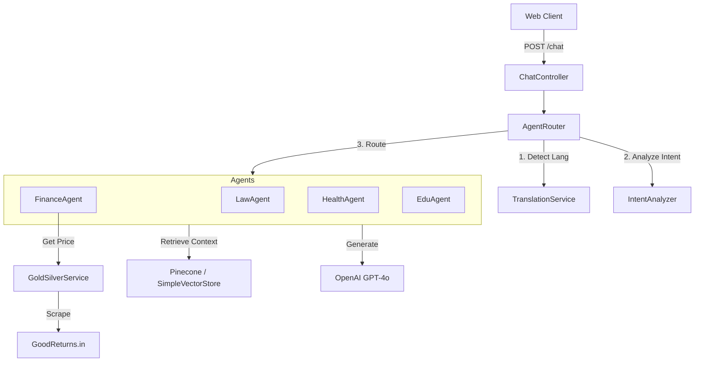

# Detailed Design Document (DDD)

## 1. Introduction
**Project**: Sarva AI Core
**Version**: 1.0
**Date**: 2026-02-13

This document provides the detailed design and implementation specifics for the Sarva AI ecosystem, filling the gap between the high-level architecture and the code.

## 2. System Architecture

### 2.1 Logical View
The system follows a **Spring Boot Layered Architecture**:

1.  **Presentation Layer (Web/Mobile)**:
    - `index.html`: Single Page Application (SPA).
    - `ChatController`: REST API for text messages.
    - `VoiceController`: REST API for audio blobs.

2.  **Orchestration Layer**:
    - `AgentRouter`: Central hub that dispatches queries.
    - `IntentAnalyzer`: Uses LLM/Rules to determine the user's intent (e.g., "Legal" vs "Finance").
    - `TranslationService`: Intercepts inputs/outputs for multi-language support.

3.  **Domain Layer (The Agents)**:
    - `SarvaAgent` (Interface): Defines `handle()` and `handleStream()` methods.
    - **Implementations**:
        - `LawAgent`: RAG on `law.txt`.
        - `FinanceAgent`: Real-time scraping (`GoldSilverService`) + RAG on `finance.txt`.
        - `HealthAgent`: RAG on `health.txt`.
        - `EduAgent`, `MatrimonyAgent`, `IoTAgent`, `CommerceAgent`: RAG-based specialists.

4.  **Infrastructure Layer**:
    - **Spring AI**: Abstraction over OpenAI API.
    - **Pinecone**: Vector database for document embeddings (RAG).
    - **Jsoup**: Web scraping for real-time data.

### 2.2 Component Diagram


## 3. Class Design

### 3.1 Core Interfaces
**`SarvaAgent` Interface**:
```java
public interface SarvaAgent {
    String getName();
    String handle(String query, ConversationMemory memory);
    Flux<String> handleStream(String query, ConversationMemory memory);
}
```

### 3.2 Key Classes
-   **`AgentRouter`**:
    -   *Responisbility*: Orchestrates the request lifecycle.
    -   *Key Method*: `route(String query, String inputLang, String outputLang, ConversationMemory memory)`
    -   *Logic*:
        1.  Check Cache/FastPath.
        2.  Call `TranslationService` to normalize to English.
        3.  Call `IntentAnalyzer` to get Category (e.g., "FINANCE").
        4.  Select `SarvaAgent` bean matching Category.
        5.  Execute Agent.
        6.  Translate response back to target language.

-   **`FinanceAgent`**:
    -   *Responsibility*: Handles financial queries.
    -   *Logic*:
        -   If query contains "gold/silver" -> Call `GoldSilverService`.
        -   Else -> Use Spring AI `ChatClient` with `QuestionAnswerAdvisor` (RAG).

-   **`GoldSilverService`**:
    -   *Responsibility*: Fetch live metal rates.
    -   *Logic*: Uses `Jsoup` to scrape `goodreturns.in`. Implements `@Cacheable` to reduce external calls. Calculates linear regression for predictions.

## 4. Data Design

### 4.1 Knowledge Base
Text generation is grounded in static text files located in `src/main/resources/`:
-   `law.txt`: Indian Penal Code summaries.
-   `finance.txt`: Investment basics.
-   So on for other domains.

### 4.2 Vector Store
-   **Embeddings**: `text-embedding-ada-002` (OpenAI).
-   **Storage**: Pinecone (Production) or `SimpleVectorStore` (Dev/Fallback).
-   **Ingestion**: `DataLoader` class loads `.txt` files on startup, chunks them, computes embeddings, and stores them.

## 5. Security & Configuration
-   **API Keys**: Managed via Environment Variables (`OPENAI_API_KEY`).
-   **CORS**: Configured to allow local development (localhost:8080).
-   **Rate Limiting**: currently implicit via OpenAI API limits.

## 6. Future Considerations
-   Switch from Jsoup scraping to official APIs for reliability.
-   Implement JWT Authentication for user history persistence.
-   Migrate from `SimpleVectorStore` to a persistent instance if not already fully on Pinecone.
